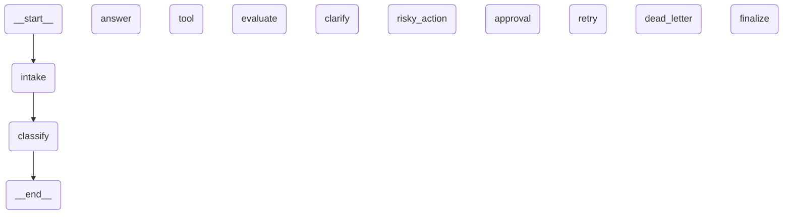

# Day 08 Lab Report

## 1. Team / student

- Name: Nguyễn Mạnh Phú
- Repo/commit: https://github.com/arthur105204/phase2-track3-day8-langgraph-agent
- Date: 11/05/2026

## 2. Architecture

Nodes: ``intake`` (normalize + PII flags), ``classify`` (token/keyword routing), ``answer``, ``tool`` (structured JSON + idempotency key), ``evaluate`` (JSON validation), ``clarify``, ``risky_action``, ``approval`` (mock / interrupt HITL), ``retry`` (bounded attempts + backoff metadata), ``dead_letter`` (JSONL escalation), ``finalize``. Append-only reducers: ``messages``, ``tool_results``, ``errors``, ``events``.

## 3. State schema

List important fields and whether they are overwrite or append-only.

| Field | Reducer | Why |
|---|---|---|
| messages | append | audit conversation/events |
| route | overwrite | current route only |

## 4. Scenario results

Key metrics (also in ``outputs/metrics.json``):

- Total scenarios: 7
- Success rate: 100.00%
- Average nodes visited: 6.43
- Total retries (retry node): 3
- Total approval nodes visited: 2

| Scenario | Expected route | Actual route | Success | Retries | Interrupts |
|---|---|---|---:|---:|---:|
| S01_simple | simple | simple | yes | 0 | 0 |
| S02_tool | tool | tool | yes | 0 | 0 |
| S03_missing | missing_info | missing_info | yes | 0 | 0 |
| S04_risky | risky | risky | yes | 0 | 1 |
| S05_error | error | error | yes | 2 | 0 |
| S06_delete | risky | risky | yes | 0 | 1 |
| S07_dead_letter | error | error | yes | 1 | 0 |

## 5. Failure analysis

Documented failure modes:

1. **Transient tool errors**: ``evaluate`` returns ``needs_retry`` when the structured payload has ``status=error`` / ``code=TRANSIENT``; ``retry`` increments ``attempt`` until ``max_attempts`` routes to ``dead_letter``.
2. **Risky actions without approval**: ``risky_action`` always precedes ``approval``; rejections route to ``clarify`` instead of executing ``tool``.

## 6. Persistence / recovery evidence

**Checkpointer:** SQLite (WAL) tại ``outputs/checkpoints.db``, cấu hình trong ``configs/lab.yaml``. Mỗi scenario chạy với ``thread_id`` cố định; ví dụ scenario ``S01_simple`` dùng ``thread-S01_simple`` trong ``graph.invoke(..., config={"configurable": {"thread_id": ...}})``.

**Time-travel / checkpoint chain:** Sau ``run-scenarios``, dùng ``graph.get_state_history(...)`` (xuất ra file ``outputs/state_history_S01.json``). Chuỗi checkpoint được liệt kê **từ mới đến cũ** (``step`` 0 = trạng thái cuối sau khi graph kết thúc). Cột ``next`` cho biết node sẽ chạy tiếp theo tại thời điểm đó; ``events_tail`` là đuôi danh sách sự kiện audit (khớp với ``nodes_visited`` trong metrics).

Trích từ ``outputs/state_history_S01.json`` (đường đi ``simple``: ``intake`` → ``classify`` → ``answer`` → ``finalize``):

| step | checkpoint_id (rút gọn) | next | route | events_tail |
|---:|---|---|---|---|
| 0 | ``…f5a2`` | *(rỗng — đã xong)* | simple | intake, classify, answer, finalize |
| 1 | ``…b921`` | finalize | simple | intake, classify, answer |
| 2 | ``…f11d`` | answer | simple | intake, classify |
| 3 | ``…fc24`` | classify | *(chưa gán route)* | intake |
| 4 | ``…6bcd`` | intake | *(chưa gán route)* | *(chưa có event)* |
| 5 | ``…ce9ff`` | __start__ | *(null)* | *(rỗng)* |

ID đầy đủ (để đối chiếu file JSON): bản ghi mới nhất là ``1f14cf21-1a81-6a7e-8004-70c12645f5a2`` (step 0); bản ghi khởi đầu luồng là ``1f14cf21-1a65-655f-bfff-ee1ea1fce9ff`` (step 5).

**Crash-resume (ý nghĩa thực tế):** Cùng file SQLite và cùng ``thread_id``, một process mới có thể tải lại checkpoint cuối và tiếp tục (mô hình LangGraph checkpoint). Phần lab chứng minh **dữ liệu checkpoint tồn tại theo từng bước**; demo resume đầy đủ có thể mô tả thêm: khởi tạo lại ``SqliteSaver`` + ``compile``, gọi ``get_state`` / ``invoke`` với ``thread_id`` không đổi sau khi dừng tiến trình cũ.

## 7. Extension work

Extensions in this submission: **SQLite WAL checkpointer** (durable checkpoints), **dead-letter JSONL** sink, **Mermaid graph export** below, and structured tool payloads.

## 8. Improvement plan

Wire a real LLM-as-judge in ``evaluate_node``, add OTLP tracing, and replace the JSONL dead-letter sink with a queue + paging integration.

## 9. Graph diagram (Mermaid)

Generated via ``get_graph().draw_mermaid()``:

